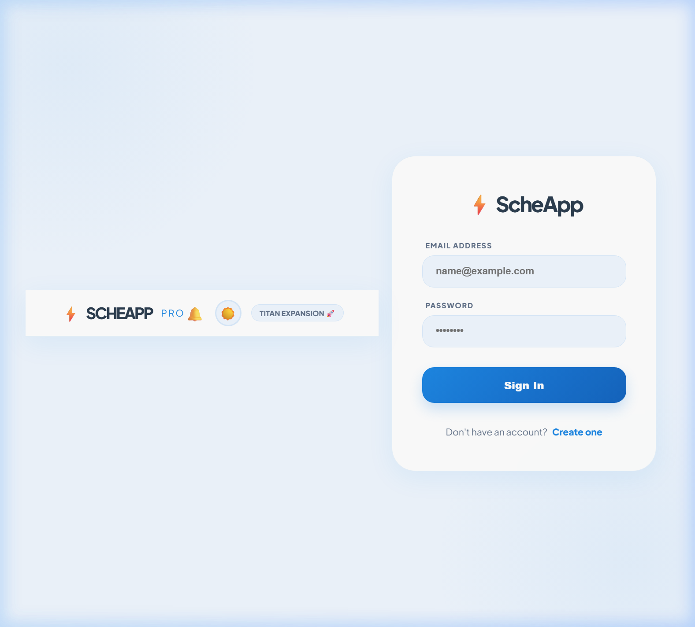
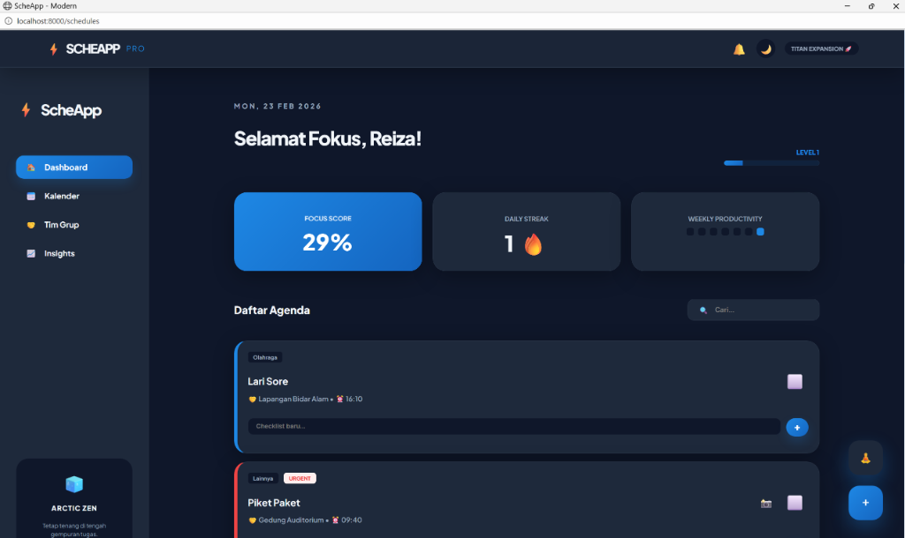
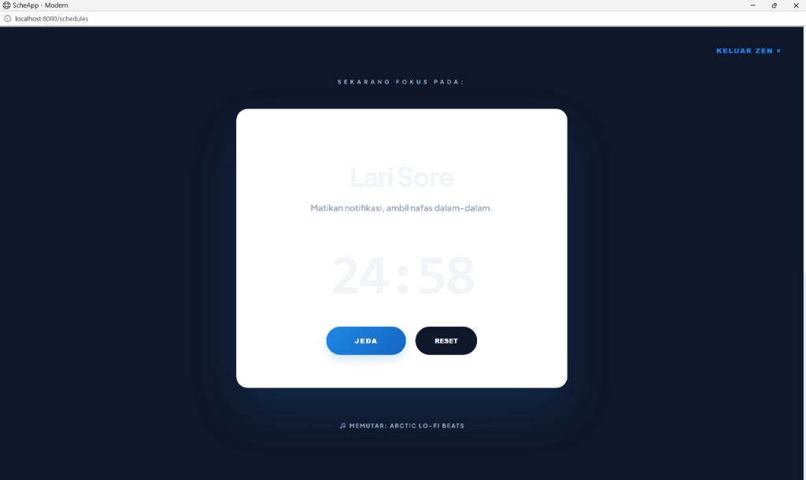
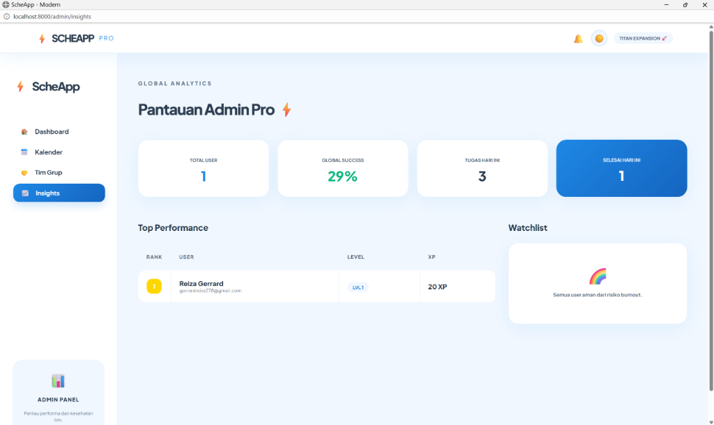
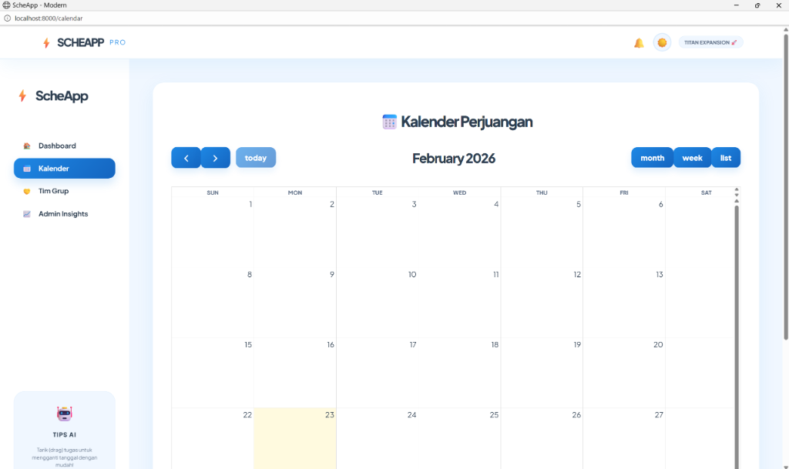
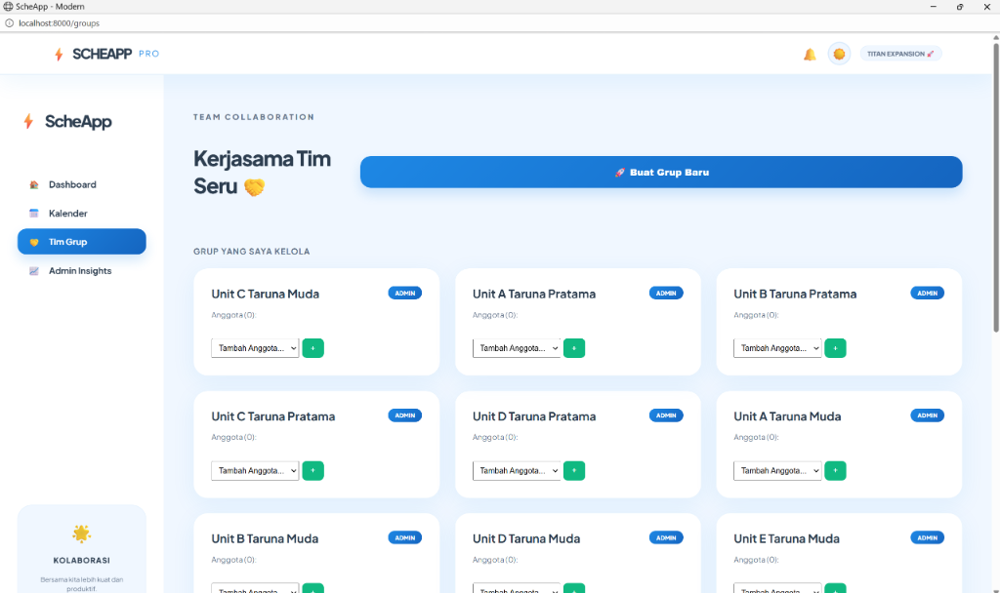
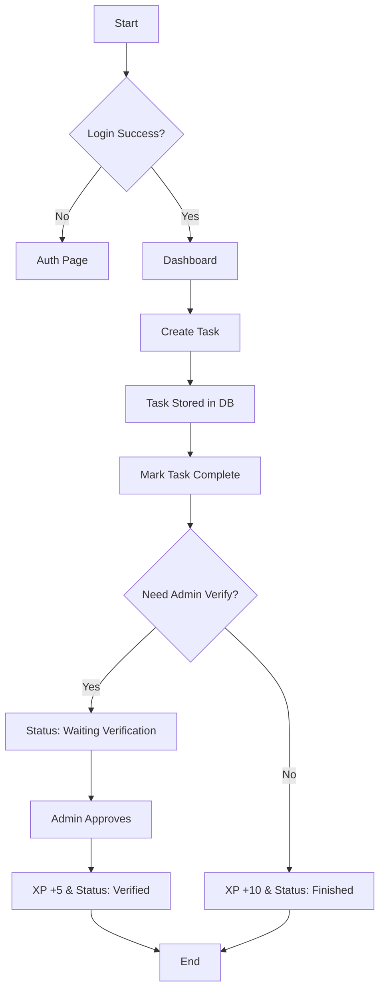
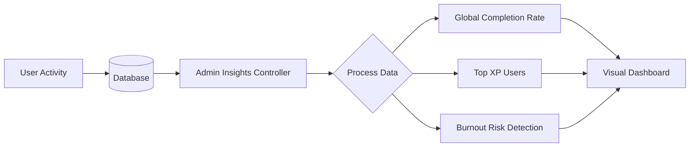
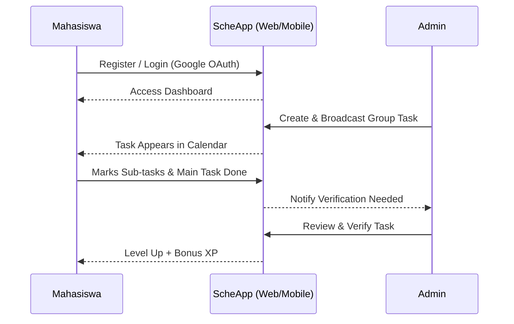

# 📋 ScheApp Pro - Elite Task Management System

Platform manajemen tugas (Task Management) berbasis **Laravel** dengan desain ceria **"Sunset Sunshine" Glassmorphism** dan dukungan **Mobile Android**. ScheApp dirancang khusus untuk meminimalisir risiko kelalaian tugas di tengah dinamika kegiatan yang padat, dilengkapi dengan fitur kolaborasi tim dan sistem dashboard admin yang canggih.

---

> [!NOTE]
> **TITAN EDITION UPDATE**: Versi terbaru kini mendukung **Sub-Tasks**, **Real File Uploads**, **Midnight Sunset (Dark Mode)**, dan **Smart Notifications Center**.

---

## 📋 Daftar Isi
- [🎯 Deskripsi](#-deskripsi)
- [✨ Fitur Utama](#-fitur-utama)
- [📊 User Flow & Use Case](#-user-flow--use-case)
- [🏗️ Arsitektur & SDLC](#-arsitektur--sdlc)
- [🛠 Tech Stack](#-tech-stack)
- [📁 Struktur Project](#-struktur-project)
- [🔗 Database Schema](#-database-schema)
- [🚀 Instalasi - Web](#-instalasi---web)
- [📱 Instalasi - Mobile](#-instalasi---mobile)
- [🔌 API Endpoints](#-api-endpoints)
- [📋 User Stories](#-user-stories)
- [🧪 Testing](#-testing)
- [📊 Development Workflow](#-development-workflow)
- [📄 Lisensi](#-lisensi)

---

## 🎯 Deskripsi
**ScheApp Pro: Arctic Zen Edition** adalah evolusi tertinggi dari manajemen jadwal personal. Lahir dari kebutuhan ksatria **Politeknik Siber dan Sandi Negara (Poltek SSN)**, aplikasi ini kini mengusung tema **Arctic Breeze** yang menenangkan dengan paduan warna *Blue Light White* dan *Arctic Blue* untuk fokus maksimal.

Aplikasi ini beralih dari sekadar pengingat menjadi ekosistem produktivitas. Dengan antarmuka **Minimalist Glassmorphism** yang mewah, ScheApp memberikan ketenangan visual di tengah jadwal yang padat. Kini didukung dengan **Zen Mode** untuk sesi kerja mendalam (*deep work*) dan **Admin Insights** untuk pemantauan performa tim secara real-time.

---

### ✨ Fitur Utama (Arctic Zen Edition)

#### 🧊 Estetika Arctic Breeze
- **Blue-Light-White Palette**: Desain yang memanjakan mata untuk penggunaan jangka panjang.
- **Glassmorphism UI**: Antarmuka transparan yang modern dan bersih.
- **Floating Action Buttons**: Akses cepat ke fitur utama tanpa mengganggu konten.

#### 🧘 Zen Mode (Deep Work Engine)
- **Pomodoro Timer**: Sesi fokus 25 menit yang terintegrasi.
- **Urgent Task Sync**: Fokus otomatis pada tugas paling mendesak.
- **Arctic Lo-fi Beats**: Integrasi musik latar untuk meningkatkan konsentrasi.

#### 📈 Admin Insights (Stability Optimized)
- **Cross-Database Support**: Optimal untuk SQLite dan MySQL.
- **Burnout Risk Detection**: Algoritma cerdas untuk mendeteksi kelelahan pengguna.
- **Global Leaderboard**: Kompetisi sehat berdasarkan perolehan XP.

#### 🤝 Collaboration & sub-Tasks
- **Checklist Sub-Tasks**: Dekomposisi tugas besar menjadi langkah kecil.
- **Evidence Verification**: Sistem upload bukti foto dengan verifikasi admin.
- **Real File Attachments**: Dukungan penuh untuk lampiran PDF dan Gambar.

---

## 📸 Visual Showcase (Arctic Zen Edition)

### 🧊 Login & Registration
Antarmuka login yang bersih dengan tema Arctic Breeze, memberikan kesan profesional sejak detik pertama.


### 🚀 Dashboard Utama
Pusat kontrol produktivitas dengan statistik real-time, grafik performa mingguan, dan daftar agenda yang diprioritaskan oleh AI.


### 🧘 Zen Mode
Fokus tanpa gangguan. Timer Pomodoro terintegrasi dengan musik lo-fi untuk mencapai status *deep work*.


### 📊 Admin Insights
Dashboard analitik khusus admin untuk memantau kesehatan produktivitas tim dan risiko burnout secara global.


### 📅 Kalender Perjuangan
Visualisasi jadwal bulanan yang intuitif dengan integrasi FullCalendar yang telah dikustomisasi.


### 🤝 Kerjasama Tim
Kelola grup, tambah anggota, dan pantau tugas kolektif dengan mudah dalam satu antarmuka terpadu.


---

## 📊 User Flow & Use Case

### Use Case Diagram
Peta fungsionalitas utama antara Mahasiswa dan Admin:

### Use Case Diagram
Peta fungsionalitas utama antara Mahasiswa dan Admin:


### Task Management Flow (CRUD & Verification)


### Dashboard & Analytics Flow


### Complete User Journey (End-to-End)


### Flow Interaksi Data
```text
┌─────────────┐
│   User      │
└──────┬──────┘
       │
       │ Opens App
       ▼
┌──────────────────┐
│  Login/Register  │
├──────────────────┤
│ Email + Password │
│   atau Google    │
└────────┬─────────┘
         │
         │ Success ✓
         ▼
┌────────────────────┐
│  Dashboard/Home    │
├────────────────────┤
│ Load User Tasks    │
│ Display Analytics  │
└────────┬───────────┘
         │
    ┌────┴────────────────┐
    │                     │
    ▼                     ▼
┌─────────────┐    ┌────────────────┐
│ Create Task │    │ View/Edit Task │
│ POST /tasks │    │ GET /tasks/:id │
└────┬────────┘    └────────┬───────┘
     │                      │
     │ Save to DB           │ Update DB
     ▼                      ▼
┌─────────────────────────────────┐
│     MySQL Database              │
│  (Persist Task Data)            │
└─────────────────────────────────┘
```

---

## 🏗️ Arsitektur & SDLC

### Diagram Arsitektur Keseluruhan
```text
┌─────────────────────────────────────────────────────────────┐
│                    SCHEAPP PRO ENTERPRISE                   │
├─────────────────────────────────────────────────────────────┤
│                       Frontend Layer                        │
│  ┌──────────────┐                          ┌──────────────┐ │
│  │  Web App     │                          │  Mobile App  │ │
│  │ (Blade +     │                          │  (Kotlin +   │ │
│  │  Vanilla CSS)│                          │  WebView)    │ │
│  └──────┬───────┘                          └──────┬───────┘ │
└─────────┼──────────────────────────────────────────┼─────────┘
          │                                          │
          │          HTTP/REST API                   │
          │         (Laravel Core)                   │
          │                                          │
┌─────────┴──────────────────────────────────────────┴─────────┐
│                    Backend Layer (Web)                       │
│              ┌─────────────────────────────────┐             │
│              │      Laravel 11 Framework       │             │
│              ├─────────────────────────────────┤             │
│              │  ✓ Routing & Controllers        │             │
│              │  ✓ Authentication (Socialite)   │             │
│              │  ✓ Database ORM (Eloquent)      │             │
│              │  ✓ Validation & Security        │             │
│              │  ✓ Admin Insight Engine         │             │
│              └─────────────────────────────────┘             │
└┬────────────────────────────────────────────────────────────┬┘
 │                                                            │
 │                   Data Persistence Layer                  │
 │                                                            │
┌┴────────────────────────────────────────────────────────────┐
│                  MySQL 8.0+ Database                        │
│  ┌───────────────────────────────────────────────────────┐  │
│  │  Tables:                                              │  │
│  │  • users (auth & gamification)                        │  │
│  │  • schedules (task management)                        │  │
│  │  • groups & group_user (team system)                  │  │
│  │  • sub_tasks (checklist items)                        │  │
│  └───────────────────────────────────────────────────────┘  │
└─────────────────────────────────────────────────────────────┘
```

### Metode Pengembangan (SDLC)
Aplikasi ini dikembangkan menggunakan metode **Waterfall**, yang terdiri dari tahapan terstruktur:

1.  **Requirement Analysis**: Identifikasi kebutuhan mahasiswa Poltek SSN terhadap manajemen waktu.
2.  **System Design**: Perancangan skema database, UI Glassmorphism, dan alur kolaborasi tim.
3.  **Implementation**: Koding backend (Laravel), frontend (Blade/CSS), dan mobile wrapper.
4.  **Testing**: Pengujian fungsionalitas (Black Box) dan verifikasi alur verifikasi admin.
5.  **Deployment**: Push ke GitHub dan persiapan template Android Studio.

---

## 🛠 Tech Stack

### Teknologi Web Frontend
| Layer | Technology | Purpose |
|---|---|---|
| UI Framework | Blade Templates + Alpine.js | Server-side rendering & interactivity |
| Styling | Vanilla CSS (Glassmorphism) | Luxury & modern responsive UI |
| Build Tool | Vite 7 | Fast bundling & development |
| Icons | Emoji & Custom Icons | Pure visual aesthetics |

### Teknologi Web Backend
| Component | Technology | Purpose |
|---|---|---|
| Framework | Laravel 11 | Core web framework |
| Language | PHP 8.2+ | Modern server-side logic |
| Auth System | Custom + Session | Multi-role authentication |
| Database | MySQL 8.0+ | Persistent data storage |
| OAuth | Socialite | Google login integration |
| Testing | PHPUnit 11 | Business logic verification |

### Teknologi Mobile
| Component | Technology | Purpose |
|---|---|---|
| Language | Kotlin / Java | Android development |
| SDK | Android 14.0+ | Contemporary API level support |
| Container | WebView Native | Fast web-to-mobile conversion |
| Networking | Android System WebView | Seamless local/host communication |

---

## 📁 Struktur Project
```text
ScheApp-by-Gerrard/
├── app/                               # 🌐 Web Logic (Laravel)
│   ├── Http/
│   │   ├── Controllers/               # Business logic
│   │   ├── Middleware/                # Auth & Role filtering
│   │   └── Requests/                  # Form validation
│   ├── Models/
│   │   ├── User.php                   # User & XP logic
│   │   ├── Schedule.php               # Core Task model
│   │   └── Group.php                  # Team system logic
├── android_studio_kotlin_template/    # 📱 Mobile App (Kotlin)
│   ├── MainActivity.kt               # WebView entry point
│   ├── build.gradle.kts              # Build configuration
│   └── AndroidManifest.xml           # App permissions
├── config/                            # Platform configuration
├── database/
│   ├── migrations/                    # Database schema
│   ├── seeders/                       # Data seeding logic
├── resources/
│   ├── views/                         # Blade (UI) templates
│   ├── css/                           # Styling assets
│   └── js/                            # Frontend scripts
├── routes/
│   ├── web.php                        # Main web routes
│   └── api.php                        # External API routes
├── public/                            # Assets & Manifests
├── storage/                           # System logs & cache
├── README.md                          # Elite documentation
└── .env                               # Environment variables
```

---

## 🔗 Database Schema

### Entity Relationship Diagram
```text
┌──────────────────────────────────┐
│         USERS                    │
├──────────────────────────────────┤
│ • id (PK)                        │
│ • name                           │
│ • email (UNIQUE)                 │
│ • password                       │
│ • xp (gamification)              │
│ • level                          │
│ • streak                         │
└────────────┬─────────────────────┘
             │
             │ 1:N relationship
             │
             ▼
┌──────────────────────────────────┐
│         SCHEDULES                │
├──────────────────────────────────┤
│ • id (PK)                        │
│ • user_id (FK)                   │
│ • group_id (FK - Nullable)       │
│ • activity_name                  │
│ • category                       │
│ • priority                       │
│ • is_completed                   │
│ • is_verified                    │
└──────────────────────────────────┘

┌──────────────────────────────────┐
│         GROUPS (Teams)           │
├──────────────────────────────────┤
│ • id (PK)                        │
│ • name                           │
│ • admin_id (FK to Users)         │
└──────────────────────────────────┘
```

**Status & Priority Definitions:**
- **Status:** `Waiting Verify`, `Verified`, `Selesai`, `Terlewat`.
- **Priority:** `Low`, `Medium`, `High` (dengan penanda warna khusus).

---

## � Instalasi - Web

### Prerequisites
- PHP 8.2+
- MySQL 8.0+
- Node.js 18+ (Vite support)
- Composer 2.0+

### Step 1: Clone & Setup Project
```bash
# Clone repository
git clone https://github.com/gerrard046/ScheApp-by-Gerrard.git
cd ScheApp-by-Gerrard

# Install dependencies
composer install
npm install
```

### Step 2: Konfigurasi Environment
```bash
# Copy .env file
cp .env.example .env

# Generate application key
php artisan key:generate
```

### Step 3: Database Setup
Edit `.env` untuk konfigurasi database:
```env
DB_CONNECTION=mysql
DB_HOST=127.0.0.1
DB_PORT=3306
DB_DATABASE=scheapp
DB_USERNAME=root
DB_PASSWORD=
```
Jalankan migrations:
```bash
php artisan migrate
php artisan db:seed
```

### Step 4: Build Frontend Assets
```bash
npm run build
# atau untuk development dengan hot reload:
npm run dev
```

### Step 5: Jalankan Server
```bash
# Gunakan host 0.0.0.0 agar bisa diakses App Mobile
php artisan serve --host=0.0.0.0
```
Server akan berjalan di: `http://localhost:8000`

---

## 📱 Instalasi - Mobile

### Prerequisites
- Android Studio (Jellyfish atau lebih baru)
- Android SDK 31+
- Kotlin 1.9+ / JDK 17+

### Step 1: Setup Template
Source code mobile tersedia di folder khusus:
📁 `android_studio_kotlin_template`

### Step 2: Open in Android Studio
1. Buka Android Studio.
2. Pilih **File > New > Project from Existing Sources**.
3. Navigasi ke folder project ScheApp.
4. Android Studio akan otomatis download dependencies.

### Step 3: Configure API Endpoint
Edit `MainActivity.kt` untuk menghubungkan ke server laptop:
```kotlin
// Gunakan IP Laptop jika pakai physical device
// Gunakan 10.0.2.2 jika pakai emulator
val serverUrl = "http://10.0.2.2:8000/schedules"
```

### Step 4: Build & Run
- **Via Android Studio**: Klik tombol "Run" atau `Shift+F10`.
- **Via Command Line**:
```bash
./gradlew assembleDebug
./gradlew installDebug
```

---

## 🔌 API Endpoints

### Authentication
| Method | Endpoint | Description |
|---|---|---|
| POST | `/register` | Register new user |
| POST | `/login` | Login user session |
| POST | `/logout` | Terminate session |
| GET | `/auth/google` | OAuth via Google |

### Tasks Management
| Method | Endpoint | Description |
|---|---|---|
| GET | `/schedules` | View all tasks |
| POST | `/schedules` | Create new schedule |
| GET | `/schedules/{id}/edit` | Get specific task details |
| POST | `/schedules/{id}/toggle` | Toggle completion & verification |
| DELETE | `/schedules/{id}` | Delete specific task |

### Admin & Groups
| Method | Endpoint | Description |
|---|---|---|
| GET | `/admin/insights` | Global analytics dashboard |
| GET | `/groups` | Manage team groups |
| POST | `/groups` | Create new team |

---

## 📋 User Stories

### Web Platform
- **Sebagai mahasiswa**, saya ingin login dengan Google agar bisa langsung akses dashboard tanpa ribet.
- **Sebagai pengguna**, saya ingin melihat visualisasi produktivitas 7 hari terakhir agar bisa memantau performa.
- **Sebagai admin**, saya ingin mem-broadcast tugas grup agar tim saya tidak ketinggalan jadwal penting.

### Mobile Platform
- **Sebagai mahasiswa**, saya ingin cek tugas lewat HP agar tetap produktif meski sedang di luar ksatrian.
- **Sebagai pengguna**, saya ingin aplikasi terasa ringan (WebView) agar memori HP tidak cepat penuh.
- **Sebagai admin**, saya ingin melakukan verifikasi tugas anggota langsung dari HP.

---

## 🧪 Testing

### Web Testing
```bash
# Run all tests
php artisan test

# Run with coverage (Xdebug required)
php artisan test --coverage
```

### Mobile Testing
```bash
# Run unit tests
./gradlew test

# Run instrumentation tests
./gradlew connectedAndroidTest
```

---

## 📊 Development Workflow

### Git Branch Strategy
```text
main           (Stable production code)
  ↑
develop        (Integration branch)
  ↑
feature/XYZ    (Individual feature development)
```

---

## 📄 Lisensi
Projek ini dibuat untuk memenuhi tugas akademik (UAS). Lisensi: **MIT**.

---

**Dibuat oleh:** [Reiza Gerrard](https://github.com/gerrard046) 
**Project Info:** Pengembangan Aplikasi Penjadwalan Dinamis Poltek SSN.
