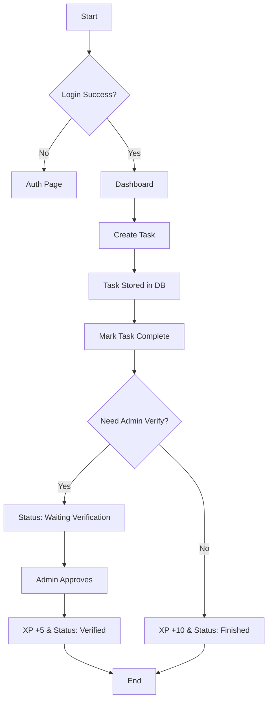
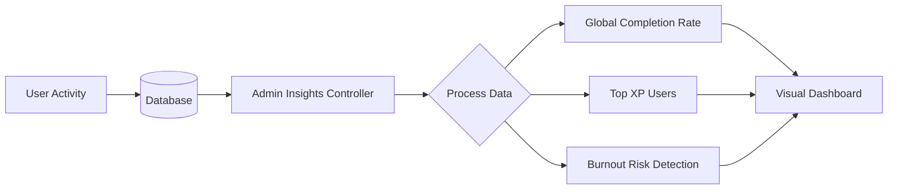
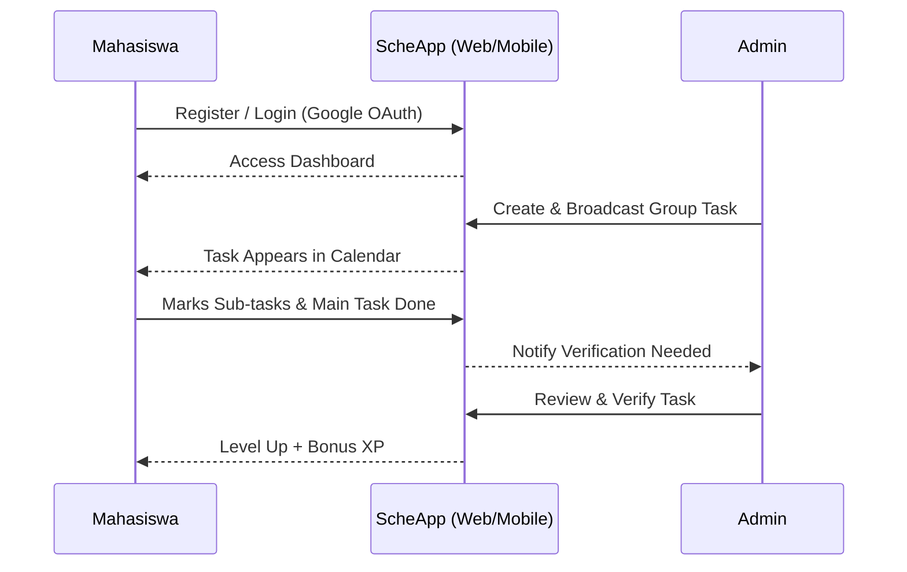

# 📋 ScheApp Pro - Elite Task Management System

Platform manajemen tugas (Task Management) berbasis **Laravel** dengan desain modern **Glassmorphism** dan dukungan **Mobile Android**. ScheApp dirancang khusus untuk meminimalisir risiko kelalaian tugas di tengah dinamika kegiatan yang padat, dilengkapi dengan fitur kolaborasi tim dan sistem dashboard admin yang canggih.

---

## 📋 Daftar Isi
- [🎯 Deskripsi](#-deskripsi)
- [✨ Fitur Utama](#-fitur-utama)
- [📊 User Flow & Use Case](#-user-flow--use-case)
- [🏗️ Arsitektur & SDLC](#-arsitektur--sdlc)
- [🛠 Tech Stack](#-tech-stack)
- [� Struktur Project](#-struktur-project)
- [🔗 Database Schema](#-database-schema)
- [�📱 Mobile App Integration](#-mobile-app-integration)
- [🚀 Instalasi & Konfigurasi](#-instalasi--konfigurasi)
- [🔌 API Endpoints](#-api-endpoints)
- [🤝 Kontribusi](#-kontribusi)
- [📄 Lisensi](#-lisensi)

---

## 🎯 Deskripsi
**ScheApp Pro** lahir dari kebutuhan mendesak mahasiswa **Politeknik Siber dan Sandi Negara (Poltek SSN)**. Dengan dinamika kegiatan ksatrian dan akademik yang sangat padat, seringkali tugas atau rencana kegiatan yang sudah tersusun rapi menjadi keteteran atau terlupakan. 

Aplikasi ini merupakan evolusi dari manajemen jadwal personal menjadi sistem kolaborasi tim yang lengkap. ScheApp memungkinkan pengguna untuk tidak hanya mengatur jadwal pribadi, tetapi juga bekerja dalam grup, menerima broadcast tugas dari admin, dan berkompetisi secara sehat lewat sistem **Gamification (XP & Leveling)** demi menjaga produktivitas di tengah kesibukan yang tinggi.

Dengan antarmuka **Glassmorphism** yang mewah dan responsif, ScheApp memberikan pengalaman pengguna yang premium baik di browser desktop maupun di layar smartphone melalui wrapper Android Native.

---

## ✨ Fitur Utama

### 🔐 Autentikasi & Keamanan
- **Bcrypt Security**: Enkripsi password tingkat tinggi.
- **Google OAuth**: Login sekali klik via akun Google (Laravel Socialite).
- **IsAdmin Middleware**: Proteksi rute khusus untuk level Administrator.

### 🤝 Kolaborasi Tim (Enterprise)
- **Group Management**: Admin dapat membuat grup dan mengelola anggota tim.
- **Schedule Broadcasting**: Admin membuat satu agenda, otomatis masuk ke kalender seluruh anggota grup.

### 📈 Admin Insights (Master Analytics)
- **Global Overview**: Pantau total tugas selesai seluruh user.
- **Top Performance**: Peringkat user berdasarkan perolehan XP.
- **Burnout Risk Detection**: Deteksi dini user yang kelelahan berdasarkan jumlah tugas terlewat.

### ✅ Verification System
- **Task Approval**: Tugas yang diselesaikan user membutuhkan verifikasi Admin.
- **Bonus XP**: User mendapatkan +5 XP tambahan setelah tugas diverifikasi sukses.

### 🎮 Gamification & Productivity
- **Dynamic XP & Leveling**: Naik level setiap 100 XP.
- **Productivity Heatmap**: Visualisasi produktivitas selama 7 hari terakhir.
- **Streak System**: Menjaga konsistensi aktivitas harian.

---

## 📊 User Flow & Use Case

### Use Case Diagram
Peta fungsionalitas utama antara Mahasiswa dan Admin:

### Use Case Diagram
Peta fungsionalitas utama antara Mahasiswa dan Admin:


### Task Management Flow (CRUD & Verification)


### Dashboard & Analytics Flow


### Complete User Journey (End-to-End)


### Flow Interaksi Data
```text
┌─────────────┐
│   User      │
└──────┬──────┘
       │
       │ Opens App
       ▼
┌──────────────────┐
│  Login/Register  │
├──────────────────┤
│ Email + Password │
│   atau Google    │
└────────┬─────────┘
         │
         │ Success ✓
         ▼
┌────────────────────┐
│  Dashboard/Home    │
├────────────────────┤
│ Load User Tasks    │
│ Display Analytics  │
└────────┬───────────┘
         │
    ┌────┴────────────────┐
    │                     │
    ▼                     ▼
┌─────────────┐    ┌────────────────┐
│ Create Task │    │ View/Edit Task │
│ POST /tasks │    │ GET /tasks/:id │
└────┬────────┘    └────────┬───────┘
     │                      │
     │ Save to DB           │ Update DB
     ▼                      ▼
┌─────────────────────────────────┐
│     MySQL Database              │
│  (Persist Task Data)            │
└─────────────────────────────────┘
```

---

## 🏗️ Arsitektur & SDLC

### Diagram Arsitektur Keseluruhan
```text
┌─────────────────────────────────────────────────────────────┐
│                    SCHEAPP PRO ENTERPRISE                   │
├─────────────────────────────────────────────────────────────┤
│                       Frontend Layer                        │
│  ┌──────────────┐                          ┌──────────────┐ │
│  │  Web App     │                          │  Mobile App  │ │
│  │ (Blade +     │                          │  (Kotlin +   │ │
│  │  Vanilla CSS)│                          │  WebView)    │ │
│  └──────┬───────┘                          └──────┬───────┘ │
└─────────┼──────────────────────────────────────────┼─────────┘
          │                                          │
          │          HTTP/REST API                   │
          │         (Laravel Core)                   │
          │                                          │
┌─────────┴──────────────────────────────────────────┴─────────┐
│                    Backend Layer (Web)                       │
│              ┌─────────────────────────────────┐             │
│              │      Laravel 11 Framework       │             │
│              ├─────────────────────────────────┤             │
│              │  ✓ Routing & Controllers        │             │
│              │  ✓ Authentication (Socialite)   │             │
│              │  ✓ Database ORM (Eloquent)      │             │
│              │  ✓ Validation & Security        │             │
│              │  ✓ Admin Insight Engine         │             │
│              └─────────────────────────────────┘             │
└┬────────────────────────────────────────────────────────────┬┘
 │                                                            │
 │                   Data Persistence Layer                  │
 │                                                            │
┌┴────────────────────────────────────────────────────────────┐
│                  MySQL 8.0+ Database                        │
│  ┌───────────────────────────────────────────────────────┐  │
│  │  Tables:                                              │  │
│  │  • users (auth & gamification)                        │  │
│  │  • schedules (task management)                        │  │
│  │  • groups & group_user (team system)                  │  │
│  │  • sub_tasks (checklist items)                        │  │
│  └───────────────────────────────────────────────────────┘  │
└─────────────────────────────────────────────────────────────┘
```

### Metode Pengembangan (SDLC)
Aplikasi ini dikembangkan menggunakan metode **Waterfall**, yang terdiri dari tahapan terstruktur:

1.  **Requirement Analysis**: Identifikasi kebutuhan mahasiswa Poltek SSN terhadap manajemen waktu.
2.  **System Design**: Perancangan skema database, UI Glassmorphism, dan alur kolaborasi tim.
3.  **Implementation**: Koding backend (Laravel), frontend (Blade/CSS), dan mobile wrapper.
4.  **Testing**: Pengujian fungsionalitas (Black Box) dan verifikasi alur verifikasi admin.
5.  **Deployment**: Push ke GitHub dan persiapan template Android Studio.

---

## 🛠 Tech Stack

### Teknologi Web Frontend
| Layer | Technology | Purpose |
|---|---|---|
| UI Framework | Blade Templates + Alpine.js | Server-side rendering & interactivity |
| Styling | Vanilla CSS (Glassmorphism) | Luxury & modern responsive UI |
| Build Tool | Vite 7 | Fast bundling & development |
| Icons | Emoji & Custom Icons | Pure visual aesthetics |

### Teknologi Web Backend
| Component | Technology | Purpose |
|---|---|---|
| Framework | Laravel 11 | Core web framework |
| Language | PHP 8.2+ | Modern server-side logic |
| Auth System | Custom + Session | Multi-role authentication |
| Database | MySQL 8.0+ | Persistent data storage |
| OAuth | Socialite | Google login integration |
| Testing | PHPUnit 11 | Business logic verification |

### Teknologi Mobile
| Component | Technology | Purpose |
|---|---|---|
| Language | Kotlin / Java | Android development |
| SDK | Android 14.0+ | Contemporary API level support |
| Container | WebView Native | Fast web-to-mobile conversion |
| Networking | Android System WebView | Seamless local/host communication |

---

## 📁 Struktur Project
```text
ScheApp-by-Gerrard/
├── app/                               # 🌐 Web Logic (Laravel)
│   ├── Http/
│   │   ├── Controllers/               # Business logic
│   │   ├── Middleware/                # Auth & Role filtering
│   │   └── Requests/                  # Form validation
│   ├── Models/
│   │   ├── User.php                   # User & XP logic
│   │   ├── Schedule.php               # Core Task model
│   │   └── Group.php                  # Team system logic
├── android_studio_kotlin_template/    # 📱 Mobile App (Kotlin)
│   ├── MainActivity.kt               # WebView entry point
│   ├── build.gradle.kts              # Build configuration
│   └── AndroidManifest.xml           # App permissions
├── config/                            # Platform configuration
├── database/
│   ├── migrations/                    # Database schema
│   ├── seeders/                       # Data seeding logic
├── resources/
│   ├── views/                         # Blade (UI) templates
│   ├── css/                           # Styling assets
│   └── js/                            # Frontend scripts
├── routes/
│   ├── web.php                        # Main web routes
│   └── api.php                        # External API routes
├── public/                            # Assets & Manifests
├── storage/                           # System logs & cache
├── README.md                          # Elite documentation
└── .env                               # Environment variables
```

---

## 🔗 Database Schema

### Entity Relationship Diagram
```text
┌──────────────────────────────────┐
│         USERS                    │
├──────────────────────────────────┤
│ • id (PK)                        │
│ • name                           │
│ • email (UNIQUE)                 │
│ • password                       │
│ • xp (gamification)              │
│ • level                          │
│ • streak                         │
└────────────┬─────────────────────┘
             │
             │ 1:N relationship
             │
             ▼
┌──────────────────────────────────┐
│         SCHEDULES                │
├──────────────────────────────────┤
│ • id (PK)                        │
│ • user_id (FK)                   │
│ • group_id (FK - Nullable)       │
│ • activity_name                  │
│ • category                       │
│ • priority                       │
│ • is_completed                   │
│ • is_verified                    │
└──────────────────────────────────┘

┌──────────────────────────────────┐
│         GROUPS (Teams)           │
├──────────────────────────────────┤
│ • id (PK)                        │
│ • name                           │
│ • admin_id (FK to Users)         │
└──────────────────────────────────┘
```

**Status & Priority Definitions:**
- **Status:** `Waiting Verify`, `Verified`, `Selesai`, `Terlewat`.
- **Priority:** `Low`, `Medium`, `High` (dengan penanda warna khusus).

---

## 📱 Mobile App Integration
ScheApp kini tersedia dalam versi Android melalui pendekatan **WebView Native Wrapper**.

### Prasyarat Mobile
- Android Studio Jellyfish (atau lebih baru)
- Android Device / Emulator (API 24+)

### Dokumentasi Source Code
Source code untuk Android Studio tersedia di folder:
📁 `android_studio_kotlin_template`

---

## 🚀 Instalasi & Konfigurasi

### Step 1: Clone & Setup
```bash
git clone https://github.com/gerrard046/ScheApp-by-Gerrard
cd ScheApp-by-Gerrard
composer install
npm install
```

### Step 2: Konfigurasi Environment
Salin file `.env.example` menjadi `.env` dan sesuaikan database serta API Key Google:
```env
DB_CONNECTION=mysql
DB_DATABASE=scheapp
GOOGLE_CLIENT_ID=your_id
GOOGLE_CLIENT_SECRET=your_secret
```

### Step 3: Database & Key
```bash
php artisan key:generate
php artisan migrate
```

### Step 4: Menjalankan Server
```bash
# Agar bisa diakses dari HP di jaringan yang sama
php artisan serve --host=0.0.0.0
```

---

## 🔌 API Endpoints
Base URL: `http://localhost:8000/api`

| Method | Endpoint | Description |
|---|---|---|
| GET | `/api/tasks` | Mengambil semua daftar tugas |
| POST | `/api/tasks` | Menambahkan tugas baru |
| PUT | `/api/tasks/{id}` | Memperbarui status tugas |

---

## 🤝 Kontribusi
Kontribusi sangat terbuka! Silakan lakukan **Fork** dan **Pull Request** ke branch `main`. Pastikan mengikuti standar kodingan Laravel.

---

## 📄 Lisensi
Projek ini dibuat untuk memenuhi tugas akademik (UAS). Lisensi: **MIT**.

---

**Dibuat oleh:** [Reiza Gerrard](https://github.com/gerrard046) 
**Project Info:** Pengembangan Aplikasi Penjadwalan Dinamis Poltek SSN.
