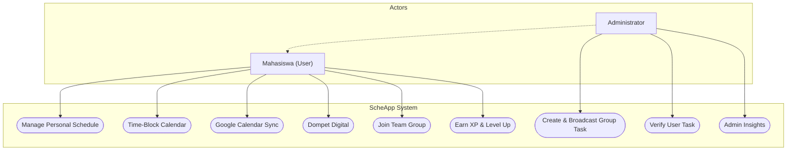
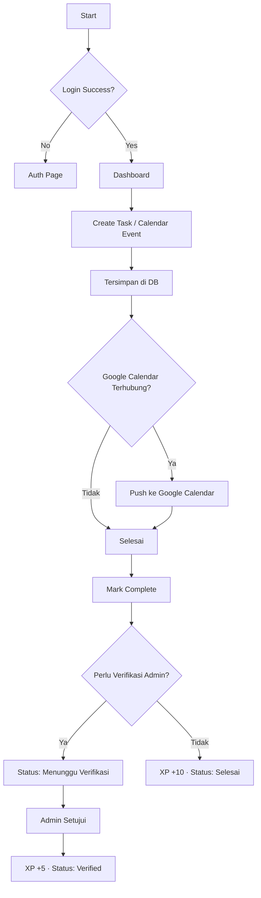
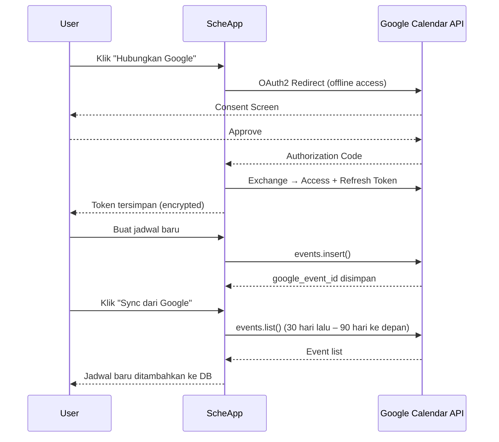

# 📋 ScheApp Pro — Dynamic Scheduling System

Platform manajemen jadwal berbasis **Laravel 12** dengan desain *Arctic Breeze Glassmorphism*, kalender **Time-Block interaktif**, sinkronisasi **Google Calendar**, dan dukungan **PWA / Mobile Android**. Dirancang untuk meminimalisir risiko kelalaian tugas di lingkungan akademik yang padat, dilengkapi fitur kolaborasi tim, dompet digital, dan sistem dashboard admin.

---

## 📋 Daftar Isi
- [🎯 Deskripsi](#-deskripsi)
- [✨ Fitur Utama](#-fitur-utama)
- [📊 User Flow & Use Case](#-user-flow--use-case)
- [🏗️ Arsitektur & SDLC](#-arsitektur--sdlc)
- [🛠 Tech Stack](#-tech-stack)
- [📁 Struktur Project](#-struktur-project)
- [🔗 Database Schema](#-database-schema)
- [🚀 Instalasi - Web](#-instalasi---web)
- [📱 Instalasi - Mobile (PWA & Android Studio)](#-instalasi---mobile-pwa--android-studio)
- [🔌 API Endpoints](#-api-endpoints)
- [📋 User Stories](#-user-stories)
- [🧪 Testing](#-testing)
- [📄 Lisensi](#-lisensi)

---

## 🎯 Deskripsi

**ScheApp Pro** adalah sistem penjadwalan dinamis yang lahir dari kebutuhan **Politeknik Siber dan Sandi Negara (Poltek SSN)**. Aplikasi ini telah berevolusi dari task manager sederhana menjadi ekosistem produktivitas lengkap dengan:

- **Time-Block Calendar** bergaya Google Calendar (drag, drop, resize)
- **Sinkronisasi dua arah Google Calendar** via OAuth2
- **Dompet Digital** untuk manajemen keuangan personal
- **PWA (Progressive Web App)** — bisa diinstall di HP tanpa App Store
- **Glassmorphism UI** dengan tema Arctic Breeze

---

## ✨ Fitur Utama

### 🗓️ Time-Block Calendar
- Kalender mingguan (`timeGridWeek`) berbasis **FullCalendar v5**
- **Drag & drop** event untuk reschedule instan
- **Resize** event untuk mengubah durasi
- Modal create/edit dengan color picker 10 warna + custom hex
- Dukungan **recurring event** (RRULE)
- Event all-day & timed dalam satu tampilan

### ☁️ Google Calendar Sync (Two-Way)
- OAuth2 login dengan akun Google
- **Push**: jadwal di ScheApp otomatis muncul di Google Calendar
- **Pull**: event dari Google Calendar ditarik ke ScheApp
- Token refresh otomatis, tersimpan terenkripsi

### 💰 Dompet Digital
- Pencatatan pemasukan & pengeluaran
- Kategori transaksi & ringkasan saldo
- Riwayat transaksi dengan filter

### 📊 Manajemen Jadwal & Tim
- CRUD jadwal personal & grup
- Kanban board (drag & drop antar status)
- Verifikasi tugas oleh admin dengan bukti digital
- Broadcast jadwal ke seluruh anggota grup
- Sistem XP & Level (gamifikasi)

### 📱 PWA & Mobile
- **Installable** di Android/iOS langsung dari browser Chrome
- Fullscreen, icon di homescreen, tanpa address bar
- Shortcuts ke Jadwal, Kalender, dan Dompet
- Offline fallback via service worker
- Siap di-wrap dengan **Capacitor** untuk APK Android Studio

### 🧊 UI/UX Arctic Breeze
- Glassmorphism dengan `backdrop-filter: blur`
- Dark mode toggle
- Mobile bottom navigation
- Web push notifications

---

## 📊 User Flow & Use Case

### Use Case Diagram


### Task Management Flow


### Google Calendar Sync Flow


---

## 🏗️ Arsitektur Sistem & Metodologi

### Diagram Arsitektur
```text
┌─────────────────────────────────────────────────────────────┐
│                    SCHEAPP PRO ARCHITECTURE                 │
├─────────────────────────────────────────────────────────────┤
│                       Presentation Layer                    │
│  ┌──────────────────┐              ┌──────────────────────┐ │
│  │   Web Browser    │              │  Mobile (PWA / APK)  │ │
│  │ Blade + Alpine.js│              │ Capacitor / WebView  │ │
│  └────────┬─────────┘              └──────────┬───────────┘ │
└───────────┼──────────────────────────────────-┼─────────────┘
            │        HTTP / AJAX (Axios)         │
┌───────────┴────────────────────────────────────┴────────────┐
│                Application Layer (Backend)                  │
│         ┌──────────────────────────────────────┐            │
│         │         Laravel 12 Ecosystem         │            │
│         │  Controllers · Services · Models     │            │
│         └─────────────────┬────────────────────┘            │
│                           │                                 │
│         ┌─────────────────▼────────────────────┐            │
│         │      Google Calendar Service         │            │
│         │  OAuth2 · Push · Pull · Token Refresh│            │
│         └──────────────────────────────────────┘            │
└───────────────────────────┬─────────────────────────────────┘
                            │
┌───────────────────────────▼─────────────────────────────────┐
│                   Data Persistence Layer                    │
│              SQLite / MySQL — Laravel Eloquent              │
└─────────────────────────────────────────────────────────────┘
```

### Metodologi SDLC (Waterfall)
1. **Analisis Kebutuhan** — identifikasi kebutuhan penjadwalan akademik
2. **Desain Sistem** — ERD, wireframe, arsitektur API
3. **Implementasi** — Laravel backend + Alpine.js frontend
4. **Uji Coba** — Black-Box Testing fungsional
5. **Deployment** — GitHub Codespaces + PWA

---

## 🛠 Tech Stack

### Backend
| Komponen | Teknologi |
|---|---|
| Framework | Laravel 12 |
| Bahasa | PHP 8.2+ |
| Database | SQLite (default) / MySQL 8.0+ |
| Auth | Laravel Breeze (session) |
| Google API | `google/apiclient:^2.15` |
| Enkripsi token | Laravel `encrypt()` / `decrypt()` |

### Frontend
| Komponen | Teknologi |
|---|---|
| Template Engine | Laravel Blade |
| Reaktivitas | Alpine.js 3.x |
| Kalender | FullCalendar v5.11.3 (CDN) |
| HTTP Client | Axios |
| Font | Plus Jakarta Sans (Google Fonts) |

### Mobile & PWA
| Komponen | Teknologi |
|---|---|
| PWA Manifest | `public/manifest.json` |
| Service Worker | `public/service-worker.js` |
| Icon | SVG scalable (`public/icons/icon.svg`) |
| Native APK | Capacitor + Android Studio (opsional) |

---

## 📁 Struktur Project

```text
ScheApp-by-Gerrard/
├── app/
│   ├── Http/Controllers/
│   │   ├── ScheduleController.php     # CRUD jadwal + FullCalendar API
│   │   ├── GoogleCalendarController.php # OAuth2 flow + sync
│   │   ├── WalletController.php       # Dompet digital
│   │   └── GroupController.php        # Manajemen tim
│   ├── Models/
│   │   ├── Schedule.php               # toCalendarEvent(), resolveEventColor()
│   │   └── User.php                   # XP, level, google tokens
│   └── Services/
│       └── GoogleCalendarService.php  # Push/pull Google Calendar
├── config/
│   └── google.php                     # Client ID, Secret, Scopes
├── database/migrations/
│   ├── ..._create_schedules_table.php
│   ├── ..._add_timeblock_columns_to_schedules_table.php  # start/end datetime, color, dll
│   └── ..._add_google_tokens_to_users_table.php
├── public/
│   ├── manifest.json                  # PWA manifest
│   ├── service-worker.js              # Offline & caching strategy
│   └── icons/icon.svg                 # App icon
├── resources/views/
│   ├── layouts/app.blade.php          # Layout utama + mobile nav
│   ├── schedules/
│   │   ├── index.blade.php            # Dashboard jadwal
│   │   └── calendar.blade.php         # Time-Block Calendar
│   └── wallet/                        # Dompet digital views
├── routes/web.php                     # Semua route web + API kalender
└── .env.example                       # Template env (termasuk GOOGLE_*)
```

---

## 🔗 Database Schema

```text
┌──────────────────────────────────────────┐
│               USERS                      │
├──────────────────────────────────────────┤
│ id, name, email, password                │
│ xp, level, streak                        │
│ google_access_token (encrypted)          │
│ google_refresh_token (encrypted)         │
│ google_token_expires_at                  │
│ google_calendar_id                       │
└─────────────────┬────────────────────────┘
                  │ 1:N
                  ▼
┌──────────────────────────────────────────┐
│             SCHEDULES                    │
├──────────────────────────────────────────┤
│ id, user_id (FK), group_id (FK nullable) │
│ activity_name, category, priority        │
│ date, time                    ← lama     │
│ start_datetime, end_datetime  ← baru     │
│ is_all_day, color, recurrence_rule       │
│ google_event_id                          │
│ is_completed, is_verified                │
└──────────────────────────────────────────┘

┌──────────────────────────────────────────┐
│               GROUPS                     │
├──────────────────────────────────────────┤
│ id, name, admin_id (FK)                  │
└──────────────────────────────────────────┘

┌──────────────────────────────────────────┐
│           WALLET_TRANSACTIONS            │
├──────────────────────────────────────────┤
│ id, user_id (FK)                         │
│ type (income/expense), amount            │
│ category, description, date              │
└──────────────────────────────────────────┘
```

**Priority:** `low` · `med` · `high`
**Status:** Aktif · Menunggu Verifikasi · Verified · Selesai · Terlewat

---

## 🚀 Instalasi - Web

### Prasyarat
- PHP 8.2+, Composer 2+, Node.js 18+

### Langkah Instalasi

```bash
# 1. Clone repo
git clone https://github.com/gerrard046/ScheApp-by-Gerrard.git
cd ScheApp-by-Gerrard

# 2. Install dependensi
composer install
npm install

# 3. Konfigurasi environment
cp .env.example .env
php artisan key:generate

# 4. Jalankan migrasi
php artisan migrate

# 5. (Opsional) Google Calendar Sync
composer require google/apiclient:^2.15
# Isi GOOGLE_CLIENT_ID, GOOGLE_CLIENT_SECRET di .env

# 6. Jalankan server
php artisan serve
# Akses: http://127.0.0.1:8000
```

### Environment Google Calendar (opsional)
```env
GOOGLE_CLIENT_ID=your-client-id.apps.googleusercontent.com
GOOGLE_CLIENT_SECRET=your-secret
GOOGLE_REDIRECT_URI="${APP_URL}/auth/google/callback"
```
> Setup di [Google Cloud Console](https://console.cloud.google.com/) → OAuth 2.0 Credentials → Web Application

---

## 📱 Instalasi - Mobile (PWA & Android Studio)

### Opsi 1: PWA (Langsung dari Browser) — Paling Mudah
1. Buka ScheApp di **Chrome Android**
2. Tap ⋮ (titik tiga) → **"Add to Home Screen"** atau **"Install App"**
3. ScheApp muncul di homescreen — fullscreen, tanpa address bar
4. Shortcuts tersedia: Jadwal, Kalender, Dompet

### Opsi 2: APK via Capacitor + Android Studio

#### Prasyarat
- Android Studio (Hedgehog atau lebih baru)
- Node.js 18+, Android SDK 33+

#### Langkah
```bash
# 1. Install Capacitor
npm install @capacitor/core @capacitor/cli @capacitor/android

# 2. Init Capacitor (isi App Name: ScheApp Pro, Package ID: com.poltek.scheapp)
npx cap init

# 3. Build web assets
npm run build

# 4. Tambah platform Android
npx cap add android

# 5. Copy web assets ke native
npx cap sync

# 6. Buka di Android Studio
npx cap open android
```

> Di Android Studio: **Build → Build Bundle(s) / APK(s) → Build APK(s)** untuk menghasilkan file `.apk`.

---

## 🔌 API Endpoints

### Authentication
| Method | Endpoint | Deskripsi |
|---|---|---|
| POST | `/register` | Daftar akun baru |
| POST | `/login` | Login |
| POST | `/logout` | Logout |

### Jadwal — CRUD Klasik
| Method | Endpoint | Deskripsi |
|---|---|---|
| GET | `/schedules` | Dashboard jadwal |
| POST | `/schedules` | Buat jadwal baru |
| GET | `/schedules/{id}/edit` | Form edit |
| POST | `/schedules/{id}/toggle` | Toggle selesai |
| DELETE | `/schedules/{id}` | Hapus jadwal |

### Kalender — FullCalendar AJAX API
| Method | Endpoint | Deskripsi |
|---|---|---|
| GET | `/calendar` | Halaman kalender |
| GET | `/calendar/events?start=&end=` | Ambil events dalam range |
| POST | `/calendar/events` | Buat event baru |
| PATCH | `/calendar/events/{id}` | Update (drag/resize/edit) |
| DELETE | `/calendar/events/{id}` | Hapus event |

### Google Calendar
| Method | Endpoint | Deskripsi |
|---|---|---|
| GET | `/auth/google` | Mulai OAuth2 |
| GET | `/auth/google/callback` | Callback OAuth2 |
| POST | `/google/sync` | Pull dari Google Calendar |
| POST | `/google/disconnect` | Putus koneksi Google |

### Grup & Admin
| Method | Endpoint | Deskripsi |
|---|---|---|
| GET | `/groups` | Daftar grup |
| POST | `/groups` | Buat grup baru |
| GET | `/admin/insights` | Dashboard analitik admin |

### Dompet Digital
| Method | Endpoint | Deskripsi |
|---|---|---|
| GET | `/wallet` | Dashboard dompet |
| POST | `/wallet/transactions` | Catat transaksi |
| DELETE | `/wallet/transactions/{id}` | Hapus transaksi |

---

## 📋 User Stories

### Web
- Sebagai **mahasiswa**, saya ingin melihat jadwal dalam tampilan kalender mingguan agar bisa merencanakan waktu secara visual.
- Sebagai **pengguna**, saya ingin drag-and-drop event di kalender agar bisa reschedule tanpa membuka form edit.
- Sebagai **pengguna**, saya ingin sinkronisasi dengan Google Calendar agar jadwal akademik dan personal terintegrasi.
- Sebagai **pengguna**, saya ingin mencatat pengeluaran harian di dompet digital agar bisa memantau keuangan.
- Sebagai **admin**, saya ingin mem-broadcast tugas grup agar tim tidak ketinggalan jadwal penting.

### Mobile
- Sebagai **mahasiswa**, saya ingin menginstall ScheApp di homescreen HP agar bisa akses cepat seperti native app.
- Sebagai **pengguna**, saya ingin app tetap bisa digunakan saat sinyal lemah berkat offline cache.
- Sebagai **admin**, saya ingin melakukan verifikasi tugas anggota langsung dari HP.

---

## 🧪 Testing

```bash
# Jalankan semua test
php artisan test

# Test dengan coverage (butuh Xdebug)
php artisan test --coverage
```

---

## 📑 Lisensi & Pengembang

Proyek ini dikembangkan sebagai pemenuhan persyaratan akademik studi kasus Manajemen Proyek Teknologi Informasi.

**Lisensi**: MIT License
**Pengembang**: [Reiza Gerrard](https://github.com/gerrard046)
**Institusi**: Politeknik Siber dan Sandi Negara (Poltek SSN)
