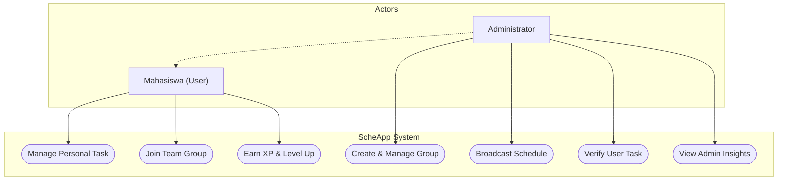
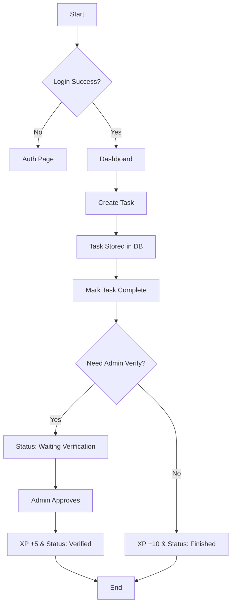
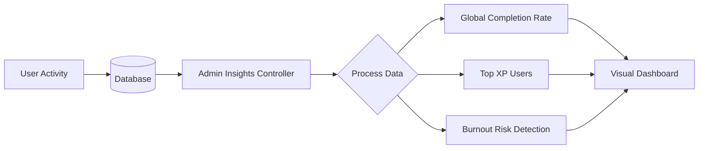
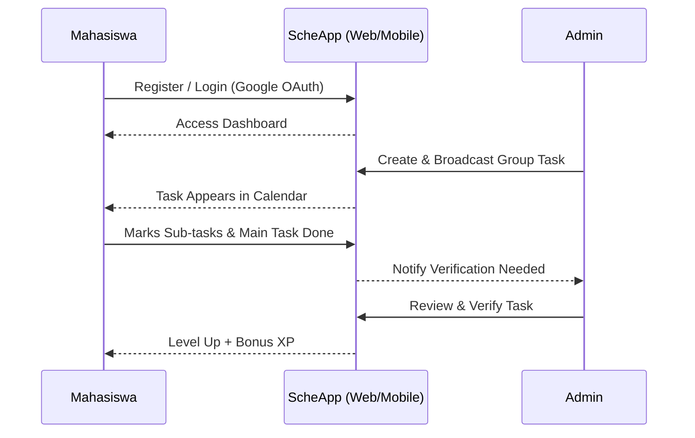

# 📋 ScheApp Pro - Elite Task Management System

Platform manajemen tugas (Task Management) berbasis **Laravel** dengan desain ceria **"Sunset Sunshine" Glassmorphism** dan dukungan **Mobile Android**. ScheApp dirancang khusus untuk meminimalisir risiko kelalaian tugas di tengah dinamika kegiatan yang padat, dilengkapi dengan fitur kolaborasi tim dan sistem dashboard admin yang canggih.

---

> [!NOTE]
> **TITAN EDITION UPDATE**: Versi terbaru kini mendukung **Sub-Tasks**, **Real File Uploads**, **Midnight Sunset (Dark Mode)**, dan **Smart Notifications Center**.

---

## 📋 Daftar Isi
- [🎯 Deskripsi](#-deskripsi)
- [✨ Fitur Utama](#-fitur-utama)
- [📊 User Flow & Use Case](#-user-flow--use-case)
- [🏗️ Arsitektur & SDLC](#-arsitektur--sdlc)
- [🛠 Tech Stack](#-tech-stack)
- [📁 Struktur Project](#-struktur-project)
- [🔗 Database Schema](#-database-schema)
- [🚀 Instalasi - Web](#-instalasi---web)
- [📱 Instalasi - Mobile](#-instalasi---mobile)
- [🔌 API Endpoints](#-api-endpoints)
- [📋 User Stories](#-user-stories)
- [🧪 Testing](#-testing)
- [📊 Development Workflow](#-development-workflow)
- [📄 Lisensi](#-lisensi)

---

## 🎯 Deskripsi
**ScheApp Pro: Arctic Zen Edition** adalah evolusi tertinggi dari manajemen jadwal personal. Lahir dari kebutuhan ksatria **Politeknik Siber dan Sandi Negara (Poltek SSN)**, aplikasi ini kini mengusung tema **Arctic Breeze** yang menenangkan dengan paduan warna *Blue Light White* dan *Arctic Blue* untuk fokus maksimal.

Aplikasi ini beralih dari sekadar pengingat menjadi ekosistem produktivitas. Dengan antarmuka **Minimalist Glassmorphism** yang mewah, ScheApp memberikan ketenangan visual di tengah jadwal yang padat. Kini didukung dengan **Zen Mode** untuk sesi kerja mendalam (*deep work*) dan **Admin Insights** untuk pemantauan performa tim secara real-time.

---

### ✨ Fitur Utama (Arctic Zen Edition)

#### 🧊 Estetika Arctic Breeze
- **Blue-Light-White Palette**: Desain yang memanjakan mata untuk penggunaan jangka panjang.
- **Glassmorphism UI**: Antarmuka transparan yang modern dan bersih.
- **Floating Action Buttons**: Akses cepat ke fitur utama tanpa mengganggu konten.

# 📋 ScheApp Pro: Dynamic Scheduling System - Arctic Zen Edition

**ScheApp Pro** merupakan sistem manajemen penjadwalan dinamis berbasis web dan mobile yang dikembangkan menggunakan framework **Laravel 11**. Sistem ini mengimplementasikan prinsip *Arctic Minimalist Glassmorphism* untuk mengoptimalkan fokus pengguna dan efisiensi manajemen waktu. Penelitian dan pengembangan ini ditujukan untuk meminimalisir risiko kelalaian tugas dalam lingkungan akademik dan organisasi yang padat.

---

> [!IMPORTANT]
> **REVISI TERBARU (ARCTIC ZEN EDITION)**: Implementasi mencakup modul **Zen Mode (Deep Work Engine)**, **Analisis Performa Admin**, **Hierarki Sub-Tugas**, serta **Sistem Verifikasi Bukti Digital (Digital Evidence Verification)**.

---

## 📸 Dokumentasi Antarmuka (Visual Showcase)

### 🧊 Modul Autentikasi & Keamanan
Implementasi antarmuka login yang menggunakan prinsip *User-Centered Design* dengan palet warna *Arctic Breeze* untuk memberikan impresi profesionalitas dan keamanan data.


### 🚀 Dasbor Utama & Manajemen Prioritas
Pusat kendali produktivitas yang mengintegrasikan algoritma prioritas tugas, statistik performa real-time, dan visualisasi aktivitas mingguan untuk pemantauan progres yang objektif.


### 🧘 Zen Mode (Konsentrasi Mendalam)
Modul khusus untuk mendukung metode *Deep Work* melalui integrasi pengatur waktu Pomodoro dan stimulan audio low-frequency (Lo-fi) guna menginduksi status fokus pengguna.


### 📊 Analitik Manajemen (Admin Insights)
Modul analitik terkonsolidasi bagi administrator untuk melakukan pengawasan terhadap tingkat penyelesaian tugas global serta deteksi risiko kelelahan (*burnout*) pada subjek pengguna.


### 📅 Visualisasi Kalender Dinamis
Implementasi kalender interaktif menggunakan pustaka *FullCalendar* yang telah disesuaikan untuk penyajian data jadwal secara kronologis dan sistematis.


### 🤝 Kolaborasi Tim & Grup (Team Orchestration)
Fasilitas manajemen grup yang memungkinkan orkestrasi tugas kolektif, manajemen anggota, dan distribusi tugas administratif secara efisien.


---

## 🎯 Analisis Kebutuhan & Deskripsi Proyek
**ScheApp Pro** dirancang sebagai solusi atas problematika manajemen waktu yang dialami oleh mahasiswa **Politeknik Siber dan Sandi Negara (Poltek SSN)**. Mengingat intensitas kegiatan akademik dan kedinasan yang tinggi, sistem ini hadir sebagai instrumen mitigasi terhadap risiko kelalaian tugas.

Sistem telah bertransformasi dari sekadar aplikasi pengingat menjadi platform kolaborasi tim yang holistik. Melalui penerapan strategi **Gamification (XP & Leveling System)**, sistem ini berupaya mempertahankan motivasi pengguna dalam menjaga tingkat produktivitas secara berkelanjutan.

---

## ✨ Fungsionalitas Sistem

### 1. Arsitektur UI/UX (Arctic Breeze Edition)
- **Implementasi Glassmorphism**: Penggunaan elemen antarmuka transparan untuk meningkatkan estetika visual tanpa mengorbankan fungsionalitas.
- **Optimasi Fokus**: Struktur navigasi minimalis guna mereduksi beban kognitif pengguna.

### 2. Deep Work Engine (Zen Mode)
- **Sinkronisasi Tugas Prioritas**: Pemilihan otomatis tugas dengan urgensi tertinggi selama sesi fokus.
- **Stimulasi Audio Integratif**: Penyediaan audio ambient untuk mendukung stabilitas konsentrasi.

### 3. Manajemen Tim & Akuntabilitas
- **Digital Evidence Verification**: Sistem pengunggahan buktik fisik/digital sebagai syarat validasi penyelesaian tugas.
- **Broadcasting Mechanism**: Distribusi jadwal oleh administrator ke seluruh anggota unit secara simultan.

---

## 📊 User Flow & Use Case

### Use Case Diagram
Peta fungsionalitas utama antara Mahasiswa dan Admin:



### Task Management Flow (CRUD & Verification)


### Dashboard & Analytics Flow


### Complete User Journey (End-to-End)


### Flow Interaksi Data
```text
┌─────────────┐
│   User      │
└──────┬──────┘
       │
       │ Opens App
       ▼
┌──────────────────┐
│  Login/Register  │
├──────────────────┤
│ Email + Password │
│   atau Google    │
└────────┬─────────┘
         │
         │ Success ✓
         ▼
┌────────────────────┐
│  Dashboard/Home    │
├────────────────────┤
│ Load User Tasks    │
│ Display Analytics  │
└────────┬───────────┘
         │
    ┌────┴────────────────┐
    │                     │
    ▼                     ▼
┌─────────────┐    ┌────────────────┐
│ Create Task │    │ View/Edit Task │
│ POST /tasks │    │ GET /tasks/:id │
└────┬────────┘    └────────┬───────┘
     │                      │
     │ Save to DB           │ Update DB
     ▼                      ▼
┌─────────────────────────────────┐
│     MySQL Database              │
│  (Persist Task Data)            │
└─────────────────────────────────┘
```

---

## 🏗️ Arsitektur Sistem & Metodologi

### Diagram Arsitektur
Sistem mengadopsi struktur *Client-Server* dengan Laravel sebagai *Core Logic* dan MySQL sebagai sistem manajemen basis data.

```text
┌─────────────────────────────────────────────────────────────┐
│                    SCHEAPP PRO ARCHITECTURE                 │
├─────────────────────────────────────────────────────────────┤
│                       Presentation Layer                    │
│  ┌──────────────┐                          ┌──────────────┐ │
│  │  Web Client   │                          │  Mobile App  │ │
│  │ (Blade + CSS) │                          │  (WebView)   │ │
│  └──────┬───────┘                          └──────┬───────┘ │
└─────────┼──────────────────────────────────────────┼─────────┘
          │          RESTful API communication       │
┌─────────┴──────────────────────────────────────────┴─────────┐
│                    Application Layer (Backend)               │
│              ┌─────────────────────────────────┐             │
│              │      Laravel 11 Ecosystem       │             │
│              └─────────────────────────────────┘             │
└┬────────────────────────────────────────────────────────────┬┘
 │                   Data Persistence Layer                  │
┌┴────────────────────────────────────────────────────────────┐
│                  MySQL 8.0 Management System                │
└─────────────────────────────────────────────────────────────┘
```

### Metodologi Pengembangan Perangkat Lunak (SDLC)
Proyek ini dikembangkan menggunakan model **Waterfall** yang mencakup tahapan:
1.  **Analisis Kebutuhan**: Identifikasi parameter produktivitas pengguna.
2.  **Desain Sistem**: Perancangan skema relasional (ERD) dan skema UI.
3.  **Implementasi**: Penulisan kode program (Encoding) pada sisi backend dan frontend.
4.  **Uji Coba (Testing)**: Validasi fungsional menggunakan metode *Black-Box Testing*.
5.  **Dokumentasi & Deployment**: Penulisan laporan teknis dan finalisasi deployment.

---

## 🛠 Spesifikasi Teknologi (Tech Stack)

### Komponen Backend & Middleware
- **Framework**: Laravel 11.x
- **Bahasa Pemrograman**: PHP 8.2+
- **Manajemen Basis Data**: MySQL 8.0+
- **Keamanan**: Bcrypt Password Hashing & Laravel Middleware.

### Komponen Frontend & Mobile
- **Template Engine**: Laravel Blade.
- **Pustaka Interaktivitas**: Alpine.js.
- **Mobile Container**: Native Android WebView (Kotlin).

---

## 📁 Struktur Project
```text
ScheApp-by-Gerrard/
├── app/                               # 🌐 Web Logic (Laravel)
│   ├── Http/
│   │   ├── Controllers/               # Business logic
│   │   ├── Middleware/                # Auth & Role filtering
│   │   └── Requests/                  # Form validation
│   ├── Models/
│   │   ├── User.php                   # User & XP logic
│   │   ├── Schedule.php               # Core Task model
│   │   └── Group.php                  # Team system logic
├── android_studio_kotlin_template/    # 📱 Mobile App (Kotlin)
│   ├── MainActivity.kt               # WebView entry point
│   ├── build.gradle.kts              # Build configuration
│   └── AndroidManifest.xml           # App permissions
├── config/                            # Platform configuration
├── database/
│   ├── migrations/                    # Database schema
│   ├── seeders/                       # Data seeding logic
├── resources/
│   ├── views/                         # Blade (UI) templates
│   ├── css/                           # Styling assets
│   └── js/                            # Frontend scripts
├── routes/
│   ├── web.php                        # Main web routes
│   └── api.php                        # External API routes
├── public/                            # Assets & Manifests
├── storage/                           # System logs & cache
├── README.md                          # Elite documentation
└── .env                               # Environment variables
```

---

## 🔗 Skema Relasi Basis Data (ERD)

Sistem menggunakan skema basis data relasional untuk menjaga integritas data antar entitas pengguna, tugas, dan grup.

```text
┌──────────────────────────────────┐
│         USERS                    │
├──────────────────────────────────┤
│ • id (PK)                        │
│ • name                           │
│ • email (UNIQUE)                 │
│ • password                       │
│ • xp (gamification)              │
│ • level                          │
│ • streak                         │
└────────────┬─────────────────────┘
             │
             │ 1:N relationship
             │
             ▼
┌──────────────────────────────────┐
│         SCHEDULES                │
├──────────────────────────────────┤
│ • id (PK)                        │
│ • user_id (FK)                   │
│ • group_id (FK - Nullable)       │
│ • activity_name                  │
│ • category                       │
│ • priority                       │
│ • is_completed                   │
│ • is_verified                    │
└──────────────────────────────────┘

┌──────────────────────────────────┐
│         GROUPS (Teams)           │
├──────────────────────────────────┤
│ • id (PK)                        │
│ • name                           │
│ • admin_id (FK to Users)         │
└──────────────────────────────────┘
```

**Definisi Status & Prioritas:**
- **Status:** `Waiting Verify`, `Verified`, `Selesai`, `Terlewat`.
- **Priority:** `Low`, `Medium`, `High` (dengan penanda warna khusus).

---

## 🚀 Prosedur Instalasi & Konfigurasi

### Prasyarat Sistem
- PHP 8.2+
- MySQL 8.0+
- Node.js 18+ (Vite support)
- Composer 2.0+

### Konfigurasi Web Environment
1.  **Kloning Repositori**: `git clone https://github.com/gerrard046/ScheApp-by-Gerrard.git`
    `cd ScheApp-by-Gerrard`
2.  **Instalasi Dependensi**: `composer install` & `npm install`
3.  **Konfigurasi Environment**: Duplikasi `.env.example` menjadi `.env` dan sesuaikan parameter `DB_DATABASE`.
    `cp .env.example .env`
    `php artisan key:generate`
    Edit `.env` untuk konfigurasi database:
    ```env
    DB_CONNECTION=mysql
    DB_HOST=127.0.0.1
    DB_PORT=3306
    DB_DATABASE=scheapp
    DB_USERNAME=root
    DB_PASSWORD=
    ```
4.  **Inisialisasi Skema**: `php artisan migrate --seed`
5.  **Build Frontend Assets**: `npm run build` (atau `npm run dev` untuk development dengan hot reload)
6.  **Eksekusi Server**: `php artisan serve --host=0.0.0.0` (Server akan berjalan di: `http://localhost:8000`)

### Konfigurasi Mobile Wrapper

### Prasyarat Sistem
- Android Studio (Jellyfish atau lebih baru)
- Android SDK 31+
- Kotlin 1.9+ / JDK 17+

### Prosedur Instalasi
1.  Buka direktori `android_studio_kotlin_template` melalui Android Studio.
2.  Konfigurasi `BASE_URL` pada file `MainActivity.kt` menuju alamat IP server host.
    ```kotlin
    // Gunakan IP Laptop jika pakai physical device
    // Gunakan 10.0.2.2 jika pakai emulator
    val serverUrl = "http://10.0.2.2:8000/schedules"
    ```
3.  Lakukan proses *Build & Run* pada emulator atau perangkat keras Android.
    - **Via Android Studio**: Klik tombol "Run" atau `Shift+F10`.
    - **Via Command Line**:
    ```bash
    ./gradlew assembleDebug
    ./gradlew installDebug
    ```

---

## 🔌 API Endpoints

### Authentication
| Method | Endpoint | Description |
|---|---|---|
| POST | `/register` | Register new user |
| POST | `/login` | Login user session |
| POST | `/logout` | Terminate session |
| GET | `/auth/google` | OAuth via Google |

### Tasks Management
| Method | Endpoint | Description |
|---|---|---|
| GET | `/schedules` | View all tasks |
| POST | `/schedules` | Create new schedule |
| GET | `/schedules/{id}/edit` | Get specific task details |
| POST | `/schedules/{id}/toggle` | Toggle completion & verification |
| DELETE | `/schedules/{id}` | Delete specific task |

### Admin & Groups
| Method | Endpoint | Description |
|---|---|---|
| GET | `/admin/insights` | Global analytics dashboard |
| GET | `/groups` | Manage team groups |
| POST | `/groups` | Create new team |

---

## 📋 User Stories

### Web Platform
- **Sebagai mahasiswa**, saya ingin login dengan Google agar bisa langsung akses dashboard tanpa ribet.
- **Sebagai pengguna**, saya ingin melihat visualisasi produktivitas 7 hari terakhir agar bisa memantau performa.
- **Sebagai admin**, saya ingin mem-broadcast tugas grup agar tim saya tidak ketinggalan jadwal penting.

### Mobile Platform
- **Sebagai mahasiswa**, saya ingin cek tugas lewat HP agar tetap produktif meski sedang di luar ksatrian.
- **Sebagai pengguna**, saya ingin aplikasi terasa ringan (WebView) agar memori HP tidak cepat penuh.
- **Sebagai admin**, saya ingin melakukan verifikasi tugas anggota langsung dari HP.

---

## 🧪 Testing

### Web Testing
```bash
# Run all tests
php artisan test

# Run with coverage (Xdebug required)
php artisan test --coverage
```

### Mobile Testing
```bash
# Run unit tests
./gradlew test

# Run instrumentation tests
./gradlew connectedAndroidTest
```

---

## 📊 Development Workflow

### Git Branch Strategy
```text
main           (Stable production code)
  ↑
develop        (Integration branch)
  ↑
feature/XYZ    (Individual feature development)
```

---

## 📑 Penutup & Lisensi
Proyek ini dikembangkan dalam rangka pemenuhan persyaratan akademik studi kasus Manajemen Proyek Teknologi Informasi.

**Lisensi**: MIT License
**Pengembang**: [Reiza Gerrard](https://github.com/gerrard046)
**Afiliasi**: Pengembangan Sistem Penjadwalan Dinamis Poltek SSN.
